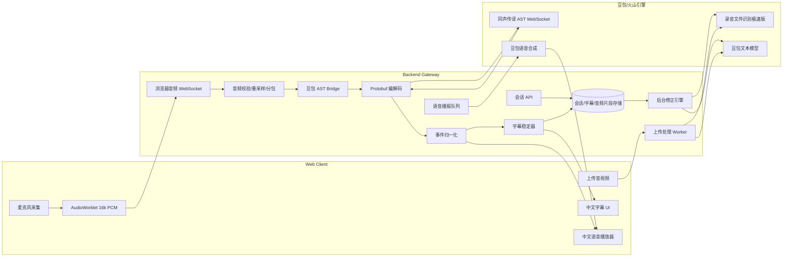

# AI 同声传译助手技术方案

> 更新时间：2026-06-05
> 版本定位：产品首版技术方案
> 供应商策略：豆包/火山引擎优先，OpenAI 作为后续可选备用 provider

## 1. 背景与目标

用户观看英语演讲、技术分享、国际会议或网课时，核心问题是“跟不上节奏”：字幕延迟高、术语不稳定、数字和专名容易错、前文错误无法修正、语音播报容易打断原声。本项目目标是开发一款 AI 同声传译助手，将单向外语音频实时翻译成中文字幕，并可选中文语音播报。

本版方案基于豆包/火山引擎重新设计完整链路。豆包同声传译模型本身支持语音到文本（S2T）和语音到语音（S2S），能覆盖实时字幕和中文语音播报的主需求。由于豆包 AST 接入是 WebSocket + protobuf + 后端鉴权，系统架构应以“后端音频网关”为中心，而不是让浏览器直接连接模型服务。

## 2. 方案结论

推荐采用 **Doubao-first 后端网关架构**：

1. **实时主链路**：浏览器采集麦克风音频，前端 AudioWorklet 转为 16kHz/16bit/单声道 PCM，发送到后端；后端通过豆包 AST WebSocket/protobuf 接入同传模型，接收源文字幕、译文字幕和可选 TTS 音频。
2. **字幕事件链路**：后端把豆包事件归一化为内部 `segment.partial`、`segment.final`、`audio.delta`、`session.error` 等事件，前端只消费统一事件协议。
3. **后台修正链路**：缓存最近音频和字幕上下文，使用豆包录音文件识别极速版或 AST 片段重放做复核，再生成 `segment.revision` 事件，平滑修正旧字幕。
4. **上传回放链路**：上传音视频经 ffmpeg 抽音、切片后，用豆包录音文件识别生成源文，再结合豆包文本模型或 AST 片段重放生成高质量中文字幕。
5. **语音播报链路**：语音开启时优先使用 AST S2S 的目标语音；如果实时会话是 S2T 或需要重播，则走豆包语音合成队列。

这个设计的关键是：**前端不感知供应商协议，后端统一处理豆包鉴权、音频格式、protobuf、模型事件和修正逻辑。**

## 3. 功能范围

### 3.1 首版必须支持

- 麦克风实时输入。
- 上传音频/视频文件生成回放字幕。
- 外语到中文的实时字幕。
- 字幕状态：临时字幕、稳定字幕、已修正字幕。
- 自动修正之前识别或翻译错误，并保留修正历史。
- 中文语音播报开关。
- 术语表、热词、替换词配置。
- 会话记录：音频时间轴、源文字幕、中文字幕、修正历史、供应商 logid。

### 3.2 首版暂不支持

- 直接捕获系统音频，例如 Zoom、YouTube、会议软件内部声卡流。
- 商用级多人说话人分离。
- 完全离线模型部署。
- 双向会议同传。
- 团队权限、计费、SLA 级监控。

### 3.3 后续扩展

- 系统音频捕获：Windows WASAPI loopback、macOS ScreenCaptureKit/BlackHole、Linux PulseAudio/PipeWire。
- 多 provider：OpenAI、Azure、Google、本地 faster-whisper。
- 桌面悬浮字幕窗或浏览器插件。
- PPT/网页上下文注入、术语自动学习。

## 4. 用户体验

### 4.1 实时同传模式

1. 用户打开网页，选择源语言、目标语言，默认目标语言为中文。
2. 用户选择模式：字幕优先（S2T）或字幕 + 语音（S2S）。
3. 用户点击“开始同传”，浏览器请求麦克风权限。
4. 前端通过 AudioWorklet 采集音频并转换为 16kHz PCM 小包。
5. 前端把音频包发送给后端 `/api/live/ws`。
6. 后端创建豆包 AST 会话，推送 StartSession 配置，持续转发音频。
7. 前端实时显示译文字幕；可展开查看源文字幕。
8. 后台复核发现错误时，旧字幕出现“已修正”标记，可查看修正前后和原因。
9. 语音开启时播放 AST 返回的目标语音；语音积压时可跳过过期片段。

### 4.2 上传回放模式

1. 用户上传音频或视频文件。
2. 后端用 ffmpeg 抽取音频，转换为适合识别的格式。
3. 短音频可直接 base64 提交；长音频使用对象存储 URL 或切片处理。
4. 使用豆包录音文件识别极速版生成源文和时间戳。
5. 使用豆包文本模型翻译，或把切片重放到 AST S2T 获取译文。
6. UI 展示带时间戳的双语字幕、术语命中和修正记录。

## 5. 总体架构



## 6. 核心技术选型

### 6.1 前端

推荐：Next.js + React + TypeScript。

前端职责：

- 获取麦克风权限。
- 使用 AudioWorklet 采集音频帧。
- 将浏览器常见的 48kHz Float32 音频降采样为 16kHz Int16 PCM。
- 通过 WebSocket 把音频帧发送给后端。
- 通过 SSE 或 WebSocket 接收字幕、修正和语音事件。
- 播放后端推送的中文音频。

为什么前端不直连豆包：

- 豆包 AST 需要 App Key、Resource ID 等鉴权信息，不应暴露到浏览器。
- AST 是 WebSocket 二进制 protobuf 协议，浏览器实现成本高。
- AST 对音频格式有严格要求，后端更适合做兜底校验、重采样和日志定位。

### 6.2 后端

推荐：Go 标准库 HTTP 服务 + SQLite 起步。

后端职责：

- 管理业务会话。
- 维护浏览器 WebSocket 和豆包 AST WebSocket 两条连接。
- 编解码豆包 AST protobuf 消息。
- 将浏览器音频重采样或重新分包为 AST 要求的格式。
- 注入热词、替换词、术语表。
- 把豆包事件转换为前端统一事件。
- 缓存音频片段和字幕上下文，用于后台修正。
- 处理上传文件、录音识别和回放字幕。

如果首版想更快落地，也可以用 Next.js API routes 承载少量普通页面接口，但 AST Bridge、上传处理和音频 WebSocket 建议放在独立 Go 服务中，避免和前端构建框架耦合。

### 6.3 存储

首版推荐：SQLite；如需快速搭建后台管理界面，可在后续引入 Prisma 或迁移到 PostgreSQL。

核心数据表：

- `sessions`：会话状态、模式、源语言、目标语言、provider、豆包 logid。
- `segments`：字幕段，保存源文、译文、开始/结束时间、状态。
- `segment_revisions`：修正历史，保存修正前后、原因、证据。
- `glossary_terms`：术语、热词、替换词。
- `audio_chunks`：音频片段元数据和本地路径。
- `provider_events`：供应商原始事件摘要，用于排障，不记录敏感密钥。

## 7. 豆包 API 选型

本方案基于 2026-06-05 查询到的火山引擎官方文档。

### 7.1 实时同传：豆包 AST

主链路使用豆包同声传译 2.0 AST 服务：

- 接口：`wss://openspeech.bytedance.com/api/v4/ast/v2/translate`
- 协议：WebSocket 二进制 protobuf。
- 模式：
  - `s2t`：语音流输入，返回源文和译文字幕。
  - `s2s`：语音流输入，返回源文、译文字幕和目标语音。
- 鉴权头：
  - `X-Api-App-Key`
  - `X-Api-Resource-Id: volc.service_type.10053`
- 音频要求：
  - 源音频 `format=wav`
  - `codec=raw`
  - `rate=16000`
  - `bits=16`
  - `channel=1`
  - 建议 80ms 左右一包。

### 7.2 语言策略

首版 UI 需要按豆包能力限制展示语言：

- S2S 适合演示“字幕 + 语音”，支持中文、英文、葡萄牙语、西班牙语、日语、印尼语、德语、法语等语种约束。
- S2T 适合演示“字幕优先”，语言覆盖更广，包含中文、英文、日语、韩语、俄语、意大利语、阿拉伯语、泰语、越南语等。
- 非中英互译时，源语言或目标语言应包含中文或英文。
- 中英混杂场景使用 `zhen`，用于中英自动识别和互译。

产品默认选择：

- 英文演讲到中文：`source_language=en`，`target_language=zh`。
- 中英混杂内容：`source_language=zhen`，`target_language=zhen`。
- 语音播报关闭：`mode=s2t`。
- 语音播报开启：`mode=s2s`。

### 7.3 术语、热词和替换词

豆包 AST 的 `corpus` 可用于干预识别和翻译：

- `hot_words_list`：提升源文识别命中，如 Kubernetes、RAG、Transformer。
- `correct_words`：替换词，用于纠正常见误识别。
- `glossary_list`：术语表，用于指导原文到译文的翻译。

后端在 StartSession 中注入初始术语配置，也支持通过 UpdateConfig 在会话中更新术语。需要注意：术语配置是“指导模型”，不保证每次强制生效，所以仍需要后台修正链路兜底。

### 7.4 上传和后台复核：豆包录音文件识别

上传模式和后台复核使用豆包录音文件识别极速版：

- 接口示例：`https://openspeech.bytedance.com/api/v3/auc/bigmodel/recognize/flash`
- Resource ID：`volc.bigasr.auc_turbo`
- 音频输入：`audio.url` 或 `audio.data` 二选一。
- 返回：整体文本、utterances、词级时间戳等。

用途：

- 上传音视频生成源文时间轴。
- 对实时 AST 已稳定的片段做二次识别。
- 修正数字、专名、术语、单位等高风险内容。

### 7.5 语音播报：AST S2S 优先，TTS 队列兜底

语音播报首选 AST S2S，因为它能在同一实时会话里返回目标语音，链路最短。

独立豆包 TTS 队列用于：

- 用户中途开启语音，需要播报后续稳定字幕。
- 上传回放模式生成中文语音。
- AST S2T 模式下补充语音。
- 用户选择固定音色、语速或重新播报。

## 8. 实时链路设计

### 8.1 会话初始化

1. 前端请求 `POST /api/sessions` 创建业务会话。
2. 后端保存源语言、目标语言、模式、术语表和用户设置。
3. 前端打开 `/api/live/ws?sessionId=...`。
4. 后端创建 `DoubaoAstSession`，连接 AST WebSocket。
5. 后端发送 StartSession protobuf：
   - `mode=s2t` 或 `mode=s2s`
   - `source_language`
   - `target_language`
   - `source_audio`
   - `target_audio`
   - `corpus`
6. AST 返回 SessionStarted 后，后端通知前端进入 running 状态。

### 8.2 音频输入

前端音频路径：

```text
getUserMedia
  -> AudioWorklet
  -> 48kHz Float32 frame
  -> downsample to 16kHz
  -> convert to Int16 PCM
  -> browser WebSocket binary frame
```

后端音频路径：

```text
browser frame
  -> validate sequence and timestamp
  -> optional jitter buffer
  -> ensure 16kHz / 16bit / mono
  -> split to about 80ms packets
  -> TaskRequest protobuf
  -> Doubao AST
```

如果浏览器降采样不可用，后端可以接收 WebM/Opus 或 PCM 原始流后用 ffmpeg 重采样，但这会增加延迟。首版建议前端先稳定完成 16k PCM 输出。

### 8.3 豆包事件到内部事件映射

```ts
type InterpretationEvent =
  | { type: "segment.partial"; segmentId: string; text: string; sourceText?: string; startMs?: number }
  | { type: "segment.final"; segmentId: string; text: string; sourceText?: string; startMs?: number; endMs?: number }
  | { type: "segment.revision"; segmentId: string; before: string; after: string; reason: string }
  | { type: "audio.delta"; segmentId?: string; audio: ArrayBuffer; codec: "pcm" | "ogg_opus" }
  | { type: "session.state"; state: "starting" | "running" | "closing" | "closed" }
  | { type: "session.error"; code: string; message: string; providerLogId?: string };
```

映射规则：

| 豆包事件 | 内部事件 | 用途 |
| --- | --- | --- |
| `SourceSubtitleStart` | segment start metadata | 标记源文句段开始 |
| `SourceSubtitleResponse` | `segment.partial.sourceText` | 源文临时字幕 |
| `SourceSubtitleEnd` | source final metadata | 源文稳定字幕 |
| `TranslationSubtitleStart` | segment start metadata | 标记译文句段开始 |
| `TranslationSubtitleResponse` | `segment.partial.text` | 中文临时字幕 |
| `TranslationSubtitleEnd` | `segment.final` | 中文稳定字幕 |
| `TTSSentenceStart` | audio segment metadata | 语音片段开始 |
| `TTSResponse` | `audio.delta` | 中文音频增量 |
| `TTSSentenceEnd` | audio done metadata | 语音片段结束 |
| `SessionFailed` | `session.error` | 会话失败 |
| `AudioMuted` | session/audio state | 静音提示 |

### 8.4 字幕稳定器

字幕稳定器不直接相信所有 partial 文本。它负责把豆包的源文和译文事件合并为稳定的业务字幕段。

规则：

- `TranslationSubtitleResponse` 进入当前临时字幕。
- `TranslationSubtitleEnd` 后转为稳定字幕。
- 同一时间窗口内的 Source/Translation 事件按 start/end time 绑定。
- 译文 final 到达但源文 final 未到达时，先显示中文，再补源文。
- 如果连续 partial 变化过大，只更新当前行，不写入历史。
- final 事件写入 `segments`，成为后台修正输入。

## 9. 自动修正链路

系统需要能自动纠正之前识别或翻译的错误。豆包 AST 负责实时输出，但旧字幕的业务级修正仍由我们自己实现。

### 9.1 修正触发条件

以下情况进入后台复核队列：

- 字幕包含数字、金额、百分比、日期、单位。
- 字幕包含术语表命中的英文词或中文译名。
- 源文和译文长度比例异常。
- 连续多个 partial 大幅变化。
- 用户点击“复核此句”。
- 上传回放模式的所有句段。

### 9.2 修正流程

1. `AudioChunkCache` 保留最近 30-90 秒音频。
2. `RepairEngine` 以稳定字幕段为单位，截取前后 1-2 秒音频上下文。
3. 将音频片段提交给豆包录音文件识别极速版，得到更完整的源文。
4. 使用豆包文本模型按术语表重新翻译；或将片段重放到 AST S2T 获取译文。
5. 对比实时字幕和复核字幕：
   - 数字、单位、专名、术语变化直接触发修正。
   - 语义差异明显触发修正。
   - 仅标点或轻微语序变化忽略。
6. 写入 `segment_revisions`。
7. 前端收到 `segment.revision` 后平滑更新旧字幕，并展示“已修正”标记。

示例：

```json
{
  "type": "segment.revision",
  "segmentId": "seg_1024",
  "before": "这个模型每秒处理十五个请求。",
  "after": "这个模型每秒处理一千五百个请求。",
  "reason": "number_correction",
  "sourceEvidence": "fifteen hundred requests per second"
}
```

### 9.3 修正策略边界

- 不在用户正在阅读的当前行频繁替换文字。
- 只修正 stable 字幕，不修正 partial 字幕。
- 修正旧字幕时保留历史。
- 修正频率要有限制，避免界面一直跳动。
- 后台修正失败不影响实时字幕主链路。

## 10. 上传回放链路

上传模式用于处理会议录制、网课文件和离线音视频资料，重点输出高质量回放字幕。

流程：

1. 上传文件到后端。
2. ffmpeg 抽取音频。
3. 转换为识别友好的格式，必要时切片。
4. 调用豆包录音文件识别极速版。
5. 根据 utterances 生成源文时间轴。
6. 使用豆包文本模型翻译为中文，带术语表约束。
7. 对数字、术语、专名做二次检查。
8. 保存 segments 和 revisions。
9. 前端展示双语字幕回放。

上传模式的目标不是“实时”，而是保证演示素材稳定可复现。

## 11. API 设计草案

### 11.1 会话

```http
POST /api/sessions
GET /api/sessions/:id
PATCH /api/sessions/:id
DELETE /api/sessions/:id
```

创建会话：

```json
{
  "provider": "doubao",
  "sourceLanguage": "en",
  "targetLanguage": "zh",
  "mode": "s2t",
  "voiceEnabled": false,
  "glossaryId": "default"
}
```

### 11.2 实时连接

```http
GET /api/live/ws?sessionId=...
GET /api/sessions/:id/events
POST /api/sessions/:id/finish
```

- `/api/live/ws`：浏览器向后端发送音频二进制帧。
- `/events`：前端接收字幕、修正、语音和状态事件。首版可用 SSE；如果要推送音频二进制，建议使用 WebSocket。
- `/finish`：前端结束会话，后端发送 FinishSession 给 AST。

### 11.3 术语表

```http
GET /api/glossaries
POST /api/glossaries
PATCH /api/glossaries/:id
POST /api/sessions/:id/glossary/update
```

术语配置会映射到豆包 `corpus.hot_words_list`、`corpus.correct_words`、`corpus.glossary_list`。

### 11.4 字幕与修正

```http
GET /api/sessions/:id/segments
GET /api/sessions/:id/revisions
POST /api/sessions/:id/segments/:segmentId/recheck
```

手动 recheck 和后台自动修正使用同一套 revision 数据结构。

### 11.5 上传

```http
POST /api/uploads
POST /api/uploads/:id/process
GET /api/uploads/:id/result
```

## 12. 前端界面结构

首版页面建议是一个工作台：

- 顶部工具条：源语言、目标语言、字幕/语音模式、术语表、开始/停止。
- 中央字幕区：当前中文最大，源文可折叠显示。
- 右侧时间轴：历史字幕、修正标记、术语命中。
- 底部状态栏：连接状态、豆包 logid、延迟、音量、电平。
- 上传标签页：上传文件、处理进度、回放字幕。

关键 UI：

- partial 字幕视觉上弱于 final 字幕。
- revision 用轻量高亮，避免闪屏。
- 中文语音播报明确标记为 AI 生成语音。
- 网络失败时提示切换上传模式。

## 13. 错误处理

| 错误 | 处理 |
| --- | --- |
| 麦克风权限失败 | 提示授权或切换上传模式 |
| 浏览器音频格式异常 | 前端降级，后端 ffmpeg 重采样 |
| AST SessionFailed | 显示 providerLogId，自动重连一次 |
| 音频包超时或间隔过长 | 暂停发送，重建 AST 会话 |
| 服务器繁忙 | 指数退避重试，保留本地录音片段 |
| TTS 积压 | 跳过过期语音，只播报最新稳定字幕 |
| 后台修正失败 | 保留原字幕，记录失败原因 |
| 上传处理失败 | 展示具体阶段：上传、抽音、识别、翻译 |

## 14. 延迟、质量和成本目标

### 14.1 延迟目标

- 字幕首段延迟：2-3 秒。
- 稳定字幕延迟：3-5 秒。
- S2S 语音延迟：3-8 秒。
- 后台修正延迟：5-30 秒。

### 14.2 质量目标

- 技术术语翻译一致。
- 数字、单位、人名、产品名优先纠错。
- 中英混杂内容可用 `zhen` 模式处理。
- 上传回放结果质量高于实时结果。

### 14.3 成本控制

- 字幕模式默认使用 S2T。
- 只有用户开启语音时使用 S2S 或 TTS。
- 后台修正只处理高风险片段。
- 上传模式限制文件大小和时长。
- 保存 provider usage event，便于后续估算成本。

## 15. 安全与隐私

- 豆包 App Key、Access Key、Resource ID 只保存在后端环境变量。
- 浏览器永远不接触供应商密钥。
- 后端日志记录 `X-Tt-Logid` 便于排障，但不记录密钥。
- 音频缓存默认短期保存，会话结束可清除。
- 上传文件限制类型、大小和时长。
- AI 语音播报需要在 UI 中明确披露。

## 16. 测试与评估

### 16.1 单元测试

- 音频重采样和分包。
- 豆包事件到内部事件映射。
- 字幕稳定器。
- 修正差异检测。
- TTS 队列过期丢弃。

### 16.2 集成测试

- 创建 session 后能建立 AST bridge。
- 模拟 Source/Translation/TTS 事件后，前端能显示字幕和音频。
- 上传音频后能生成 segments。
- 复核触发后能生成 revision。

### 16.3 演示评估

准备 3 类素材：

- 技术分享：Kubernetes、RAG、Transformer、latency。
- 国际会议：人名、组织名、日期、数字。
- 网课片段：语速较快、长句较多。

评估指标：

- 用户是否能跟上内容。
- 字幕是否连续稳定。
- 修正是否合理且不干扰阅读。
- 术语和数字是否明显优于无修正版本。

## 17. 里程碑

### M1：豆包链路设计和项目骨架

- 完成本文档。
- 初始化 Next.js + TypeScript + Go 后端。
- 配置豆包环境变量。
- 定义内部事件协议。

### M2：实时字幕主链路

- AudioWorklet 采集和降采样。
- 浏览器到后端 WebSocket。
- 后端 AST Bridge。
- S2T 字幕显示。

### M3：S2S 语音和术语干预

- S2S 模式。
- TTSResponse 播放。
- 热词、替换词、术语表注入。
- 会话中 UpdateConfig。

### M4：后台修正

- 音频片段缓存。
- 豆包录音文件识别复核。
- 修正 diff 和 revision 事件。
- UI 展示修正历史。

### M5：上传兜底和演示打磨

- 上传音视频处理。
- 回放字幕。
- 验证素材。
- 延迟、状态、logid 面板。

## 18. 主要风险

- **protobuf 接入复杂**：需要优先跑通官方示例链路，再封装 `DoubaoAstBridge`。
- **音频格式严格**：浏览器音频必须稳定转换为 16kHz、16bit、单声道。
- **前端直连不可取**：密钥和 protobuf 都应放在后端。
- **术语干预不保证强制生效**：仍需后台修正兜底。
- **S2S 语言覆盖少于 S2T**：UI 需要按模式限制语言选择。
- **现场网络不稳定**：上传兜底和固定演示素材必须提前准备。

## 19. 参考资料

- 豆包语音同传产品简介: https://www.volcengine.com/docs/6561/1631605
- 豆包同声传译 2.0 API 接入文档: https://www.volcengine.com/docs/6561/1756902
- 豆包语音识别大模型产品简介: https://www.volcengine.com/docs/6561/1354871
- 豆包大模型录音文件极速版识别 API: https://www.volcengine.com/docs/6561/1631584
- 豆包录音文件识别极速版: https://www.volcengine.com/docs/6561/192519
- 豆包语音合成大模型: https://www.volcengine.com/docs/6561/1257536
