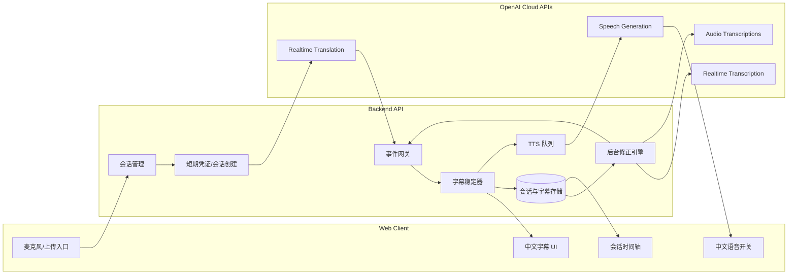

# AI 同声传译助手技术方案

> 更新时间：2026-06-05
> 版本定位：比赛/展示版技术方案
> 目标场景：英语或其他外语演讲、技术分享、国际会议、网课的一路音频输入，实时翻译为中文字幕，并可选中文语音播报。

## 1. 背景与目标

用户观看外语内容时，主要痛点不是“完全看不懂”，而是跟不上内容节奏：实时字幕延迟过高、专有名词翻译不稳定、前文识别错误无法修正、语音播报容易干扰原声。本项目目标是开发一个云端 API 优先的 AI 同声传译助手，通过低延迟字幕、后台修正和可选中文语音，降低语言门槛并提升信息获取效率。

首版选择“比赛/展示版”范围：核心体验要稳定、可演示、可解释。系统先支持麦克风实时输入和上传音频/视频兜底，不把系统音频捕获作为首版刚需。系统音频捕获可作为后续增强，以避免第一阶段陷入跨平台音频驱动和权限问题。

## 2. 方案结论

推荐采用混合架构：

1. **实时主链路**：浏览器采集麦克风音频，经后端创建短期会话后接入 OpenAI Realtime Translation，持续输出中文 transcript delta 和可选中文音频。
2. **后台修正链路**：缓存最近一段音频和上下文，使用实时转写或文件转写能力对完整句段做复核，生成字幕修正事件。
3. **语音播报链路**：字幕为主路径，中文语音为可开关增强。TTS 不阻塞字幕；过期语音可丢弃。

这种架构兼顾比赛展示所需的低延迟、流畅度和“自动纠错”亮点。实时模型负责让用户跟上内容，后台复核负责提高准确性和可信度。

## 3. 功能范围

### 3.1 首版必须支持

- 麦克风实时输入。
- 上传音频/视频文件，作为演示兜底和高质量回放模式。
- 外语到中文的实时字幕。
- 字幕状态区分：临时字幕、稳定字幕、已修正字幕。
- 自动修正之前识别或翻译错误，并在界面保留修正痕迹。
- 中文语音播报开关，默认关闭或弱提示开启。
- 术语表：用户可配置技术词、产品名、人名、缩写，提升翻译一致性。
- 会话记录：保存音频时间轴、源语言转写、中文字幕、修正历史。

### 3.2 首版暂不支持

- 直接捕获系统音频，例如 Zoom、YouTube、会议软件内部声卡流。
- 多人会议的完整说话人分离。
- 完全离线部署。
- 双向同传或实时问答助手。
- 商用级并发、计费、团队权限。

### 3.3 后续扩展

- 系统音频捕获：Windows WASAPI loopback、macOS ScreenCaptureKit/BlackHole、Linux PulseAudio/PipeWire。
- 本地模型适配：faster-whisper、NLLB/LLM、本地 TTS。
- 说话人分离、术语自动学习、PPT/网页上下文注入。
- 浏览器插件或桌面悬浮字幕窗口。

## 4. 用户体验

### 4.1 实时同传模式

1. 用户打开网页，选择源语言和目标语言，默认目标语言为中文。
2. 用户点击“开始同传”，浏览器请求麦克风权限。
3. 后端创建短期 Realtime Translation 会话，浏览器通过 WebRTC 发送音频。
4. UI 实时显示中文字幕。正在生成的句子以临时状态展示，稳定后转为普通字幕。
5. 后台复核发现错误时，字幕段落出现“已修正”状态，可展开查看修正前后。
6. 用户可开启中文语音播报。语音播报只读取稳定字幕，不读取临时字幕。

### 4.2 上传回放模式

1. 用户上传音频或视频文件。
2. 后端抽取音频并分块。
3. 使用文件转写能力生成源语言文本，再翻译成中文字幕。
4. UI 展示带时间戳的字幕、修正说明和术语命中情况。
5. 上传模式用于比赛演示兜底：即使现场网络或麦克风环境不理想，也能展示完整能力。

## 5. 总体架构



## 6. 技术选型

### 6.1 前端

推荐：Next.js + React + TypeScript。

原因：

- 浏览器侧天然支持麦克风采集、WebRTC、音频播放和字幕 UI。
- Next.js 可同时承载前端页面和轻量 API routes，适合比赛原型快速开发。
- React 便于管理字幕时间轴、修正状态、TTS 开关和上传回放界面。

关键浏览器能力：

- `navigator.mediaDevices.getUserMedia`：采集麦克风。
- `RTCPeerConnection`：浏览器到 Realtime API 的低延迟音频连接。
- DataChannel / Server-Sent Events / WebSocket：接收 transcript delta、final、revision 事件。
- Web Audio API：可选用于音量控制、静音检测、波形展示。

### 6.2 后端

推荐：Node.js + TypeScript + Fastify 或 Next.js API routes。

首版若仓库从零开始，可以用 Next.js API routes 减少工程复杂度；当功能增长后，再拆出独立 Fastify 服务。

后端职责：

- 创建 OpenAI Realtime Translation 短期会话，避免标准 API key 暴露给浏览器。
- 统一转发和归一化 AI 事件。
- 管理字幕段落、修正历史、术语表和会话记录。
- 上传文件处理、音频切分、后台复核和 TTS 队列。

### 6.3 存储

比赛版推荐：SQLite + Prisma。

原因：

- 单机演示稳定，部署简单。
- 能保存会话、字幕、修正历史和术语表。
- 后续可以迁移到 PostgreSQL。

首版数据表：

- `sessions`：会话元数据、语言、状态、开始/结束时间。
- `segments`：字幕段，包含时间戳、源文本、中文文本、状态和置信信息。
- `segment_revisions`：修正记录，保留修正前后文本和原因。
- `glossary_terms`：术语表。
- `audio_chunks`：音频片段元数据，实际音频可存本地临时目录或对象存储。

## 7. OpenAI API 选型

本方案基于 2026-06-05 查询到的 OpenAI 官方文档：

- Realtime Translation 可将源音频流实时翻译，并返回翻译音频和 transcript delta，适合 live interpretation、会议、课程等场景。
- 浏览器采集和播放音频时，官方建议优先使用 WebRTC；服务器已有原始音频流时可用 WebSocket。
- Realtime Transcription 适合实时语音转文字，可返回低延迟 transcript delta。
- Audio Transcriptions 适合上传文件或有边界的音频请求，文件上传模式支持音频/视频格式限制和分块策略。
- Speech Generation 支持将中文文本生成语音，并可流式输出音频。

### 7.1 主链路模型

主链路使用 `gpt-realtime-translate`：

- 端点：`/v1/realtime/translations`
- 输入：源语言音频。
- 输出：中文 transcript delta + 可选中文音频。
- 用途：实时字幕和可选中文语音的低延迟主体验。

该模型定位为 streaming speech-to-speech translation model，比把 ASR、翻译、TTS 三段串起来更低延迟，也更适合比赛演示。

### 7.2 后台复核模型

后台复核有两种路径：

- 实时复核：`gpt-realtime-whisper`，用于最近 30-90 秒音频的低延迟转写复核。
- 文件复核：`gpt-4o-transcribe` 或 `gpt-4o-mini-transcribe`，用于上传文件、回放模式或完整句段的高质量转写。

复核后再用文本模型或翻译模型将源文重译为中文，和主链路字幕进行差异检测。

### 7.3 TTS 模型

中文语音播报使用 `gpt-4o-mini-tts`：

- 端点：`/v1/audio/speech`
- 输入：稳定后的中文字幕。
- 输出：中文语音。
- 策略：只播报稳定字幕，不播报临时字幕；队列中过期内容可以跳过。

如果 `gpt-realtime-translate` 已经返回可用中文音频，首版可直接播放其远端音频轨。独立 TTS 队列用于更好控制语速、音色、过期丢弃和字幕一致性。

## 8. 实时处理流程

### 8.1 会话初始化

1. 前端请求 `POST /api/sessions` 创建业务会话。
2. 后端记录用户配置：源语言、目标语言、术语表、是否开启语音。
3. 前端请求 `POST /api/realtime/translation-session`。
4. 后端使用标准 API key 调用 OpenAI，创建短期 client secret 或 unified WebRTC session。
5. 前端使用短期凭证建立 WebRTC 连接。

### 8.2 字幕生成

1. Realtime Translation 返回 transcript delta。
2. `EventHub` 将原始 AI 事件归一化为内部事件：
   - `segment.partial`
   - `segment.final`
   - `segment.revision`
   - `audio.delta`
   - `session.error`
3. `SubtitleStabilizer` 按标点、停顿、最大长度和时间窗口合并 delta。
4. UI 显示最新 2-3 行字幕，历史区显示完整时间轴。

### 8.3 字幕稳定策略

字幕段进入 UI 时分三类：

- `partial`：模型仍在生成，文字较浅或带 loading 状态。
- `stable`：句段结束，暂定为稳定字幕。
- `revised`：后台复核后发现需要修正，展示“已修正”标记。

稳定条件：

- 模型发送 final 事件。
- 或检测到明显句末标点。
- 或静音超过阈值。
- 或字幕长度超过阈值，需要强制切段。

### 8.4 自动修正

系统必须能纠正之前识别或翻译的错误。首版采用“事件化修正”，不直接粗暴覆盖字幕。

修正流程：

1. `AudioBuffer` 保存最近 30-90 秒音频片段和时间戳。
2. `RepairEngine` 以稳定字幕段为单位，拼接前后上下文。
3. 对该音频片段重新转写或复核。
4. 使用术语表和上下文重新翻译。
5. 对比旧字幕和新字幕：
   - 数字、单位、人名、产品名变化直接触发修正。
   - 中文语义差异明显时触发修正。
   - 仅标点或轻微语序变化时可忽略。
6. 写入 `segment_revisions`，并向前端发送 `segment.revision`。
7. UI 平滑更新旧字幕，并保留“原文/修正后/原因”。

示例：

```json
{
  "type": "segment.revision",
  "segmentId": "seg_1024",
  "before": "这个模型每秒处理十五个请求。",
  "after": "这个模型每秒处理一千五百个请求。",
  "reason": "number_correction",
  "sourceEvidence": "fifteen hundred requests per second",
  "timestampMs": 84210
}
```

## 9. 术语和上下文管理

技术演讲经常包含产品名、库名、缩写和人名。首版应支持轻量术语表：

- 用户可在开始前导入术语，如 `Kubernetes -> Kubernetes`、`RAG -> 检索增强生成`。
- 后端在创建会话时将术语表注入模型指令。
- 后台复核时优先检查术语是否被误译。
- 修正历史可反向沉淀为临时术语建议。

术语表不是为了追求复杂知识库，而是为比赛展示提供清晰亮点：同一技术词在整场演讲中翻译一致。

## 10. 上传回放模式

上传模式是实时演示的兜底，也能展示更高质量的纠错能力。

处理流程：

1. 上传文件到后端。
2. 使用 `ffmpeg` 抽取音频，必要时压缩或切分。
3. 每段音频调用 Audio Transcriptions。
4. 使用前一段转写作为下一段 prompt 上下文，减少切段导致的信息丢失。
5. 将源文翻译为中文，并生成时间轴字幕。
6. 对专名、数字、术语进行复核。

上传文件大小超过接口限制时，必须按句子或静音边界切分，避免从句中间切断导致上下文丢失。

## 11. API 设计草案

### 11.1 会话

```http
POST /api/sessions
GET /api/sessions/:id
PATCH /api/sessions/:id
```

`POST /api/sessions` 请求示例：

```json
{
  "sourceLanguage": "en",
  "targetLanguage": "zh-CN",
  "mode": "live",
  "voiceEnabled": false,
  "glossaryId": "default"
}
```

### 11.2 实时连接

```http
POST /api/realtime/translation-session
POST /api/realtime/transcription-session
GET /api/sessions/:id/events
```

`/events` 可用 SSE 或 WebSocket 推送内部事件。首版推荐 SSE：实现简单，适合单向推送字幕事件。音频连接仍走 WebRTC。

### 11.3 字幕与修正

```http
GET /api/sessions/:id/segments
POST /api/sessions/:id/segments/:segmentId/revisions
GET /api/sessions/:id/revisions
```

后台自动修正使用同一套 revision 数据结构。未来可以允许用户手动改字幕，作为人工修正事件。

### 11.4 上传

```http
POST /api/uploads
POST /api/uploads/:id/transcribe
GET /api/uploads/:id/result
```

## 12. 前端界面结构

首版页面建议只有一个主工作台，不做营销式落地页：

- 顶部工具条：输入源、源语言、目标语言、语音开关、术语表、开始/停止。
- 中央字幕区：当前字幕最大，上一句和下一句较弱显示。
- 右侧时间轴：历史字幕、修正标记、置信提示。
- 底部状态栏：延迟、网络、AI 会话状态、音频输入电平。
- 上传标签页：上传文件、处理进度、回放字幕。

关键 UI 细节：

- 临时字幕和稳定字幕视觉区分，避免用户把未稳定文字当最终翻译。
- 修正发生时不闪屏、不大幅跳动，只给旧段落添加短暂高亮。
- 中文语音播报有明确 AI 语音提示，符合语音合成披露要求。

## 13. 延迟、质量和成本目标

### 13.1 延迟目标

- 字幕首字延迟：1-3 秒。
- 稳定字幕延迟：2-5 秒。
- 中文语音延迟：3-8 秒。
- 后台修正延迟：5-20 秒。

原则：字幕优先于语音，实时性优先于一次性完美。修正能力用于弥补早期低延迟输出的错误。

### 13.2 质量目标

- 技术词翻译一致。
- 数字、单位、人名、产品名优先纠错。
- 修正历史可追溯。
- 上传回放模式质量高于实时模式。

### 13.3 成本控制

- 实时模式按会话计时，前端需要展示会话时长和 API 状态。
- 静音时降低无效音频发送或让模型保留静音但避免额外复核。
- TTS 默认关闭或仅播报稳定字幕。
- 后台复核只处理低置信、含数字/术语、或用户关注的片段。

## 14. 安全与隐私

- 标准 OpenAI API key 只存后端环境变量，不能下发到浏览器。
- 浏览器只拿短期 client secret 或通过后端 unified session 建连。
- 音频缓存默认短期保存，用户可选择会话结束后清除。
- 上传文件设置大小、类型和时长限制。
- 日志不记录完整 API key、短期 token 或敏感原文。
- TTS 播报需要在 UI 明确提示“AI 生成语音”。

## 15. 错误处理

常见错误与处理：

- 麦克风权限失败：提示用户授权或切换上传模式。
- Realtime 连接失败：自动重连一次，仍失败则转上传/录音后处理。
- 网络抖动：字幕区显示连接状态，保留本地时间轴。
- 模型事件乱序：所有事件携带 `sequence` 和 `audioStartMs/audioEndMs`，后端按时间线归并。
- TTS 队列积压：丢弃过期语音，保证不读很久以前的句子。
- 后台复核冲突：只保留最新 revision，但 revision 历史可展开。

## 16. 测试与评估

### 16.1 单元测试

- 字幕稳定器：delta 合并、强制切段、final 更新。
- 修正引擎：差异检测、数字变化、术语命中、轻微差异忽略。
- TTS 队列：过期丢弃、暂停/恢复、开关状态。

### 16.2 集成测试

- 创建会话后能拿到实时连接配置。
- 模拟 AI 事件流后 UI 能显示 partial/stable/revised。
- 上传音频后生成 segments 和 revisions。

### 16.3 演示评估

准备 3 类样例：

- 技术分享：包含 RAG、Kubernetes、Transformer、latency 等术语。
- 国际会议：包含人名、组织名、数字和日期。
- 网课讲解：语速较快、长句较多。

评估指标：

- 用户是否能跟上内容。
- 字幕是否连续、不卡顿。
- 修正是否合理且不干扰阅读。
- 专名和数字是否明显优于无修正版本。

## 17. 里程碑

### M1：技术方案和项目骨架

- 完成本文档。
- 初始化 Next.js + TypeScript 项目。
- 配置环境变量、基础 UI 和 API 路由。

### M2：实时字幕主链路

- 麦克风采集。
- 创建 Realtime Translation 会话。
- 接收 transcript delta。
- 显示 partial/stable 字幕。

### M3：修正能力

- 建立 segment 数据模型。
- 加入音频/文本上下文缓存。
- 实现后台复核和 revision 事件。
- UI 展示修正状态。

### M4：语音播报和上传兜底

- TTS 队列和语音开关。
- 上传音频/视频处理。
- 文件转写、翻译和回放时间轴。

### M5：比赛演示打磨

- 准备固定演示素材。
- 加入延迟、状态、修正说明面板。
- 完成 README、部署说明和演示脚本。

## 18. 主要风险

- **实时翻译模型可用性和账号权限**：不同账号可能有不同模型权限。实现时需要在环境检查中明确模型可用性，并提供降级路径。
- **现场网络不稳定**：上传模式必须可用，演示素材要提前准备。
- **修正频繁导致字幕跳动**：修正只作用于稳定字幕，并用轻量视觉标记。
- **TTS 延迟影响理解**：TTS 默认不阻塞字幕，可丢弃过期内容。
- **系统音频捕获复杂**：首版不承诺，后续作为桌面版扩展。

## 19. 参考资料

- OpenAI Realtime Translation guide: https://developers.openai.com/api/docs/guides/realtime-translation
- OpenAI Realtime Transcription guide: https://developers.openai.com/api/docs/guides/realtime-transcription
- OpenAI Realtime API with WebRTC guide: https://developers.openai.com/api/docs/guides/realtime-webrtc
- OpenAI Speech to Text guide: https://developers.openai.com/api/docs/guides/speech-to-text
- OpenAI Text to Speech guide: https://developers.openai.com/api/docs/guides/text-to-speech
- OpenAI `gpt-realtime-translate` model page: https://developers.openai.com/api/docs/models/gpt-realtime-translate
- OpenAI `gpt-realtime-whisper` model page: https://developers.openai.com/api/docs/models/gpt-realtime-whisper
- OpenAI `gpt-4o-mini-tts` model page: https://developers.openai.com/api/docs/models/gpt-4o-mini-tts
